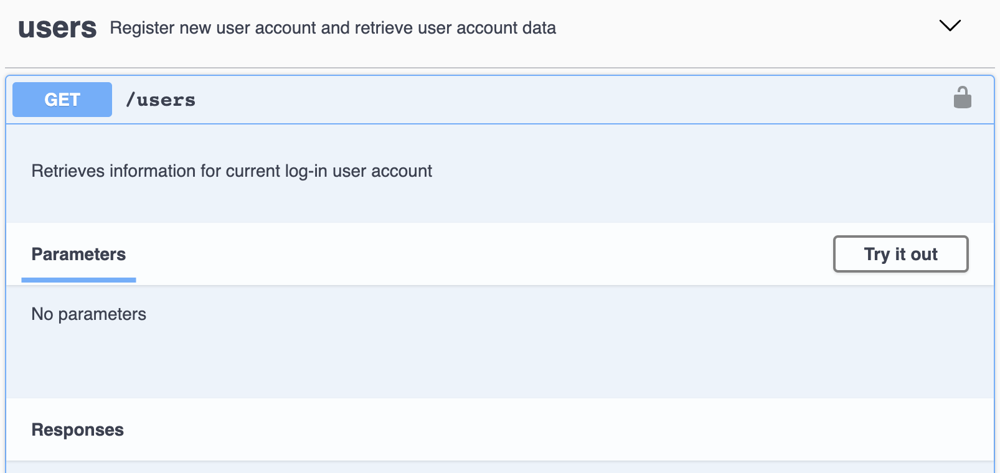

If set parameters to false or null,

Problematic code:

```typescript
  parameters: false,
```

Swagger UI will show Parameters as No parameters.


But when you click "Try it out" then Execute to test the API, the Swagger UI will keep loading.


And if you turn on the Inspect and there are some errors print on console.


Correct code:

```typescript
  parameters: {},
```

```typescript
// Initializes the `users` service on path `/users`
import { ServiceAddons } from "@feathersjs/feathers"
import { Application } from "../../declarations"
import { Users } from "./users.class"
import createModel from "../../models/users.model"
import hooks from "./users.hooks"

// Add this service to the service type index
declare module "../../declarations" {
  interface ServiceTypes {
    users: Users & ServiceAddons<any>
  }
}

export default function (app: Application) {
  const Model = createModel(app)
  const options = {
    Model,
    paginate: app.get("paginate"),
  }

  const userService = new Users(options, app)

  userService.docs = {
    description: "Register new user account and retrieve user account data",
    definitions: {
      users: {
        type: "object",
        required: ["text"],
        properties: {
          _id: {
            type: "string",
            description: "User Id",
          },
          email: {
            type: "string",
            description: "For local strategy, user register email",
          },
          appleId: {
            type: "string",
            description: "For apple oAuth strategy",
          },
          googleId: {
            type: "string",
            description: "For google oAuth strategy",
          },
          facebookId: {
            type: "string",
            description: "For facebook oAuth strategy",
          },
        },
      },
    },
    multi: ["patch"],
    operations: {
      get: false,
      remove: false,
      update: false,
      patch: false,
      patchMulti: {
        description: "Update the current logged in user account",
        parameters: {},
        security: [
          {
            BearerAuth: [],
          },
        ],
        responses: {
          201: {
            description: "success",
            content: {
              "application/json": {
                schema: {
                  $ref: "#/components/schemas/users",
                },
              },
            },
          },
          401: {
            description: "Unauthorized",
          },
          500: {
            description: "general error",
          },
        },
      },
      find: {
        description: "Retrieves information for current log-in user account",
        security: [
          {
            BearerAuth: [],
          },
        ],
        parameters: false,
        responses: {
          200: {
            description: "success",
            content: {
              "application/json": {
                schema: {
                  $ref: "#/components/schemas/users",
                },
              },
            },
          },
          401: {
            description: "Unauthorized",
          },
          500: {
            description: "general error",
          },
        },
      },
      create: {
        description: "Create user account with email and password",
        required: true,
        responses: {
          201: {
            description: "success",
            content: {
              "application/json": {
                examples: {
                  localAuthentication: {
                    value: {
                      _id: "5f245b088950e204003a09db",
                      email: "test@testing.com",
                      createdAt: "2020-07-31T17:55:20.000Z",
                      updatedAt: "2020-07-31T17:55:20.000Z",
                      isVerified: false,
                    },
                  },
                },
                schema: {
                  // $ref: '#/components/schemas/userAuthenticationResponse',
                },
              },
            },
          },
          401: {
            description: "Unauthorized",
          },
          500: {
            description: "general error",
          },
        },
        requestBody: {
          description: "Register a new account with email and password",
          required: true,
          content: {
            "application/json": {
              schema: { $ref: "#/components/schemas/localAuthentication" },
              examples: {
                localAuthentication: {
                  value: {
                    strategy: "local",
                    email: "test@testing.com",
                    password: "superpassword",
                  },
                },
              },
            },
          },
        },
      },
    },
  }
  // Initialize our service with any options it requires
  app.use("/users", userService)
  // app.use('/admin/users', userService);

  // Get our initialized service so that we can register hooks
  const service = app.service("users")

  // @ts-ignore
  service.hooks(hooks)
}
```
