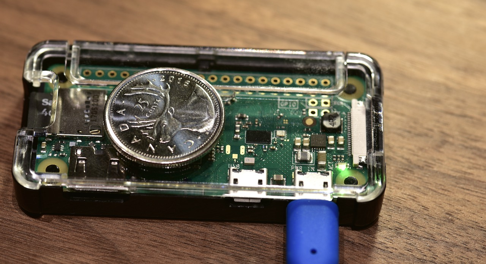

Today I recevied a Pi Zero W which I ordered last week from adafruit. Sweet! So I start playing with it. As a long time Raspberry pi player, I thought it should be pretty straight forward to set it up. But it ends up taking me few hours just to figure out how to remote SSH into it.



Since this is a headless setup, I need to load the OS, enable Wifi and turn on SSH to allow me to remote ssh into it. Here is a site with all the details how to do it: (http://desertbot.io/setup-pi-zero-w-headless-wifi/). After completed all the configuration, my Pi Zero W was able to boot up and I can find its IP address from my WiFi router. But I kept getting error when I tried to ssh the IP address of Pi Zero W.

```bash
ssh pi@192.168.31.132
Connection closed by 192.168.31.132 port 22
```

I even used nmap to make sure port 22 indeed was open:

```bash
nmap 192.168.31.132

Starting Nmap 7.60 ( https://nmap.org ) at 2017-11-07 17:06 PST
Nmap scan report for 192.168.31.132
Host is up (0.048s latency).
Not shown: 999 closed ports
PORT   STATE SERVICE
22/tcp open  ssh

Nmap done: 1 IP address (1 host up) scanned in 8.03 seconds
```

So I had no clue what's the problem then. I also turned on the details debug info of ssh but it did not help. It is my first to encounter such wired connectivity problem.

```bash
ssh -vv pi@192.168.31.132

OpenSSH_7.5p1, LibreSSL 2.5.4
debug1: Reading configuration data /etc/ssh/ssh_config
debug1: /etc/ssh/ssh_config line 52: Applying options for *
debug2: resolving "192.168.31.132" port 22
debug2: ssh_connect_direct: needpriv 0
debug1: Connecting to 192.168.31.132 [192.168.31.132] port 22.
debug1: Connection established.
debug1: identity file /Users/xudongwu/.ssh/id_rsa type 1
debug1: key_load_public: No such file or directory
debug1: identity file /Users/xudongwu/.ssh/id_rsa-cert type -1
debug1: key_load_public: No such file or directory
debug1: identity file /Users/xudongwu/.ssh/id_dsa type -1
debug1: key_load_public: No such file or directory
debug1: identity file /Users/xudongwu/.ssh/id_dsa-cert type -1
debug1: key_load_public: No such file or directory
debug1: identity file /Users/xudongwu/.ssh/id_ecdsa type -1
debug1: key_load_public: No such file or directory
debug1: identity file /Users/xudongwu/.ssh/id_ecdsa-cert type -1
debug1: key_load_public: No such file or directory
debug1: identity file /Users/xudongwu/.ssh/id_ed25519 type -1
debug1: key_load_public: No such file or directory
debug1: identity file /Users/xudongwu/.ssh/id_ed25519-cert type -1
debug1: Enabling compatibility mode for protocol 2.0
debug1: Local version string SSH-2.0-OpenSSH_7.5
debug1: Remote protocol version 2.0, remote software version OpenSSH_7.4p1 Raspbian-10+deb9u1
debug1: match: OpenSSH_7.4p1 Raspbian-10+deb9u1 pat OpenSSH* compat 0x04000000
debug2: fd 3 setting O_NONBLOCK
debug1: Authenticating to 192.168.31.132:22 as 'pi'
debug1: SSH2_MSG_KEXINIT sent
Connection reset by 192.168.31.132 port 22
```

Then I switched to google for help. And I came across to this site (https://slippytrumpet.io/posts/raspberry-pi-zero-w-setup/), it reminds me that I could use a Linux running in VirtualBox to look at the Linux partition which is not accessible inside Mac OS. After looked at the logs of Raspbian, finally I found some clues in /var/log/auth.log and I realized the sshd host key was corrupted.

So I removed the keys in /etc/sshd/ssh*host*\*. and I thought sshd will just recreate the host keys after reboot. But actually it did not! I ended up add below command in /etc/rc.local so the sshd host keys will be re-generated after reboot. After that I was able to ssh into my Pi Zero W finally!

```bash
sudo dpkg-reconfigure openssh-server
```

So that's the whole story! It was a good trouble-shooting experience. But next time if I had similar problem, I will just simply re-formate the SD card and load the Raspbian image again.

# Raspberry Pi Headless Setup

## Enable ssh

For security reasons, ssh is no longer enabled by default. To enable it, run this command:

```bash
touch /Volumes/boot/ssh
```

### Configure WiFi configuration

Create a new empty file that will hold network info:

```bash
touch /Volumes/boot/wpa_supplicant.conf
```

Edit the file that you just created and paste this into it (adjusting for the name of your country code, network name and network password):

```text
country=US
ctrl_interface=DIR=/var/run/wpa_supplicant GROUP=netdev
update_config=1

network={
    ssid="NETWORK-NAME"
    psk="NETWORK-PASSWORD"
}
```
