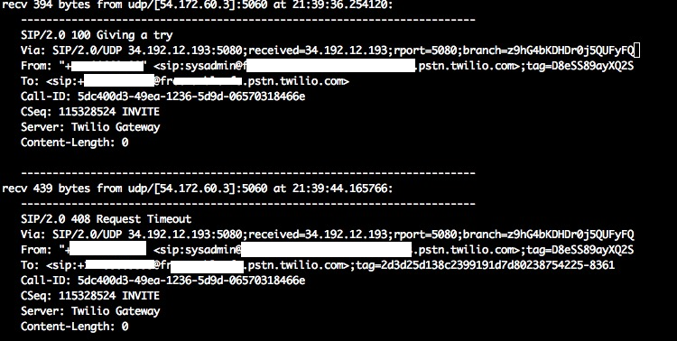

Today when I worked on a new Freeswitch server and tried to configure the SIP truncking with Twilio, I found out that I can recieved call from Twilio but I cannot make call throught Twilio gateway.

In Freeswitch log file it simply said:

```text
Originate Failed.  Cause: RECOVERY_ON_TIMER_EXPIRE
```

Then I turn on the SIP trace using fs_cli:

```bash
fs_cli
sofia global siptrace on
```

And what I found in the SIP trace is that Twilio gateway for some reason return 408 Request Timeout. I ended up spenting whole day tried to resolve this issue without any luck. I guess today is just not my day. That's just part of life...


