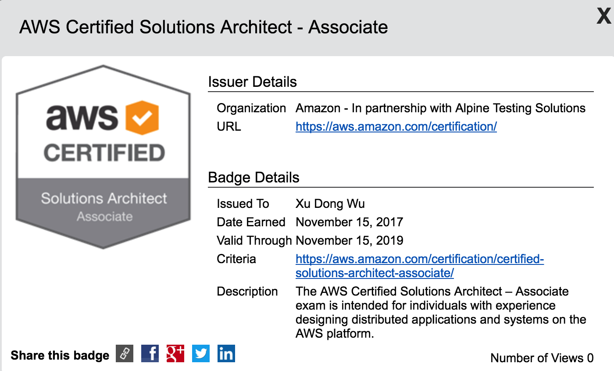

Today I passed the exam for AWS Certified Solutions Architect - Associate, and officially became certified!

And I got this interesting Digital Badges which can be accessed with this link:
https://www.certmetrics.com/amazon/public/badge.aspx?i=1&t=c&d=2017-11-15&ci=AWS00353857

I started using AWS EC2 back to 2010. But not until 2016 when I started work with this new startup company and my company pretty much run everything in AWS.

Since I uses AWS for my daily works, it doesn't take long for me to prepare for this exam, actually only two weeks. My previous certification, CISSP took me two months to prepare. Of course, comparing with CISSP 6 hours test, AWS's 80 minutes is nothing.

Talking about the test, total there are 55 questions, multiple choice and multiple answer questions, 80 minutes to complete the exam. Overall the question is not very difficult, some of them are pretty simple as long as you know the name of related AWS services. But some of them do require you have solid knowledge of AWS services. And I suspect one question is tricky question actually has no correct answer, because I am pretty sure all options are wrong for that question.

Anyway, mission accomplished! I guess my next goal will be the AWS Certified Developer – Associate.
