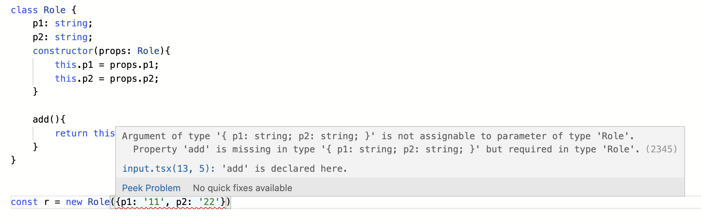

When a typescript Class has a long list of properties and methods, it is really painful when it comes to instantiate it. Let's take a look of below code example:

```typescript
class Role {
  p1: string
  p2: string
  constructor(props: Role) {
    this.p1 = props.p1
    this.p2 = props.p2
  }

  add() {
    return this.p1 + this.p2
  }
}

const r = new Role({ p1: "11", p2: "22" })
```

Typescript compiler will report an error that 'add' is missing. Typescript compiler considers Class methods as required properties if we simply use Class name as type for props.

```typescript
Argument of type '{ p1: string; p2: string; }' is not assignable to parameter of type 'Role'.
  Property 'add' is missing in type '{ p1: string; p2: string; }' but required in type 'Role'.(2345)
```



To address this error, we have to do a bit of programming on Type level. Below is the a function that excludes methods in a Class.

```typescript
type NotFunctions<T> = {
  [P in keyof T]: T[P] extends Function ? never : P
}[keyof T]
```

With this helper, combing the internal Typescript helpers: Pick and Exclude, we can come up a solution that eliminates the compiling error. Below is error-free code:

```typescript
type NotFunctions<T> = {
  [P in keyof T]: T[P] extends Function ? never : P
}[keyof T]

class Role {
  p1: string
  p2: string
  constructor(props: Pick<Role, Exclude<NotFunctions<Role>, undefined>>) {
    this.p1 = props.p1
    this.p2 = props.p2
  }

  add() {
    return this.p1 + this.p2
  }
}

const r = new Role({ p1: "11", p2: "22" })
```

What happen if there are multiple roles inherit from base class Role and we want to simply the instantiation code? We can take one step further by creating a function that can return different roles depends on the input Class.

```typescript
function CreateRole<T>(
  c: { new (p: Pick<T, Exclude<NotFunctions<T>, undefined>>): T },
  props: Pick<T, Exclude<NotFunctions<T>, undefined>>
): T {
  const newRole = new c(props)
  return newRole
}
```

Below is the final example code.

```typescript
type NotFunctions<T> = {
  [P in keyof T]: T[P] extends Function ? never : P
}[keyof T]

class Role {
  p1: string
  p2: string
  constructor(props: Pick<Role, Exclude<NotFunctions<Role>, undefined>>) {
    this.p1 = props.p1
    this.p2 = props.p2
  }

  add() {
    return this.p1 + this.p2
  }
}

class PublicRole extends Role {
  p3: string
  constructor(
    props: Pick<PublicRole, Exclude<NotFunctions<PublicRole>, undefined>>
  ) {
    super(props)
    this.p3 = props.p3
  }
  add() {
    return this.p1 + this.p2 + this.p3
  }
}

function CreateRole<T>(
  c: { new (p: Pick<T, Exclude<NotFunctions<T>, undefined>>): T },
  props: Pick<T, Exclude<NotFunctions<T>, undefined>>
): T {
  const newRole = new c(props)
  return newRole
}

const r = CreateRole(Role, { p1: "11", p2: "22" })
const r2 = CreateRole(PublicRole, { p1: "11", p2: "22", p3: "333" })
```
