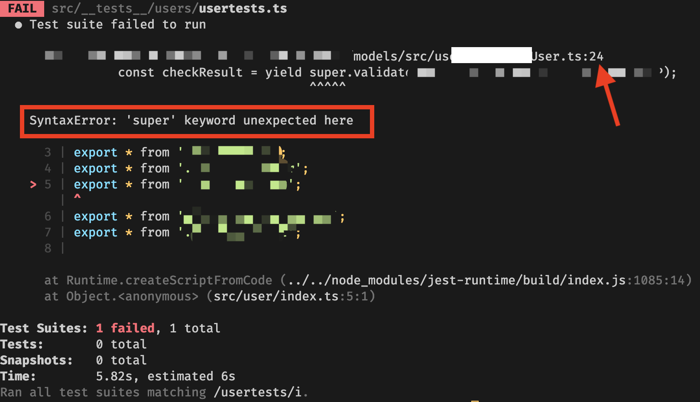

Today I encounter one issue with jest which is related to using super in arrow function in Class. Exact error shown below (I removed some private information, just to show the error)



One interesting thing here is the line info (line 24) is wrong. Somehow jest did not get that right. This is the method in the class that caused the error, it is a arrow function.

```typescript
  validate = async (): Promise<string | null> => {
    const checkResult = await super.validate();
    ...
  }
```

After I change the arrow function to method, then jest is happy now.

```typescript
  async validate(): Promise<string | null> {
    const checkResult = await super.validate();
    ...
  }
```

But why? Why super in arrow function causes such issue? With some googling, I found this article from Medium that explains the reason why.

[Arrow Functions in Class Properties Might Not Be As Great As We Think](https://medium.com/@charpeni/arrow-functions-in-class-properties-might-not-be-as-great-as-we-think-3b3551c440b1)

And this is a very well conclusion:

#### The initialization of arrow functions in class properties are transpiled into the constructor

#### Arrow functions in class properties won’t be in the prototype and we can’t call them with super

#### Arrow functions in class properties are much slower than bound functions, and both are much slower than usual function

#### You should only bind with .bind() or arrow function a method if you’re going to pass it around
