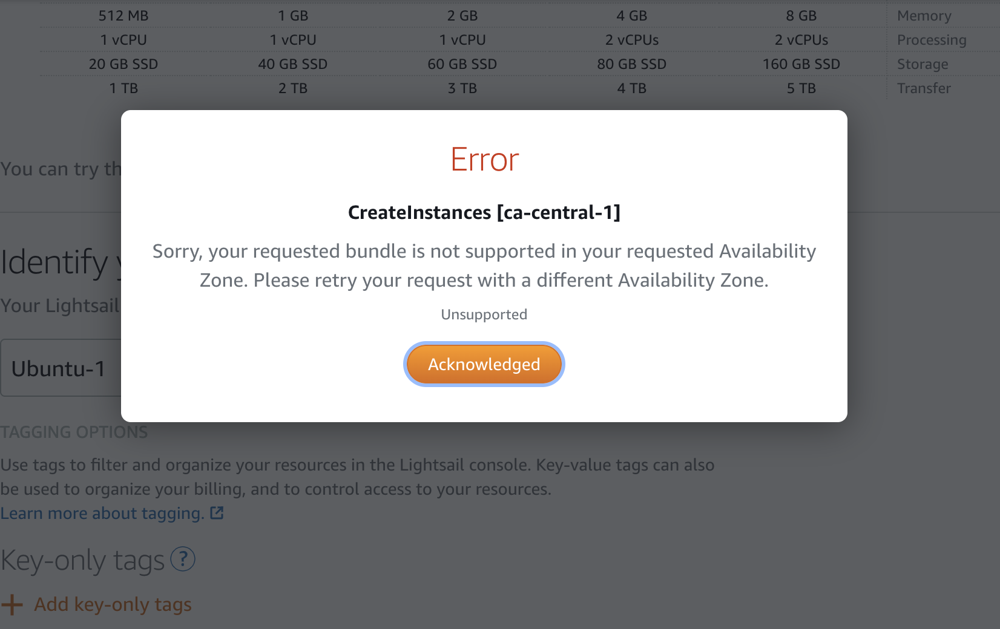
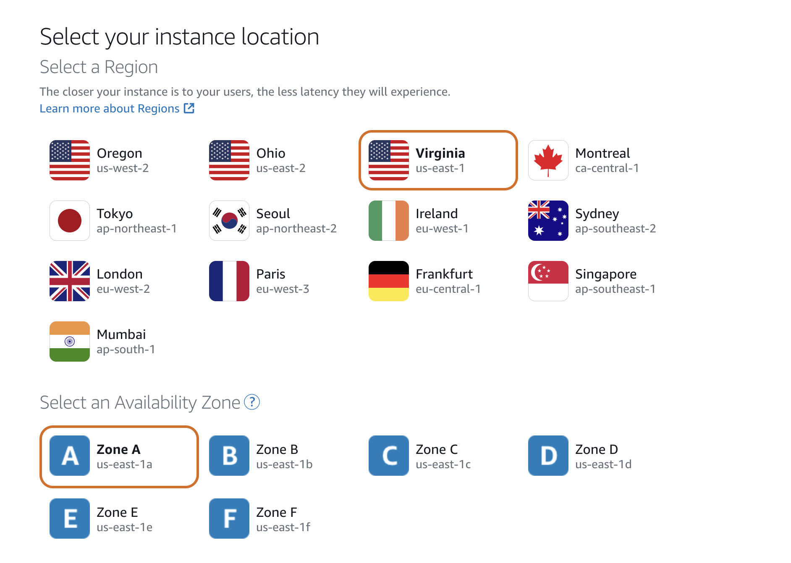
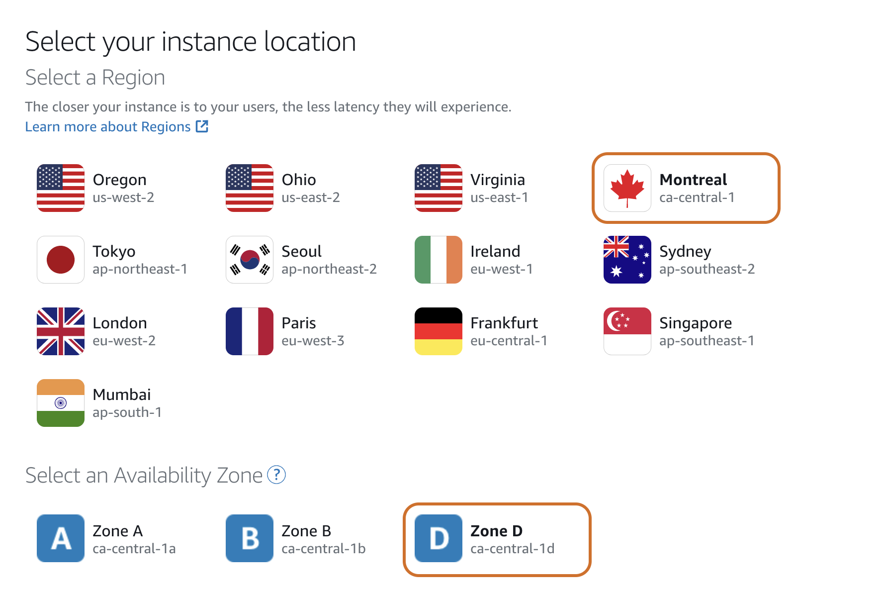
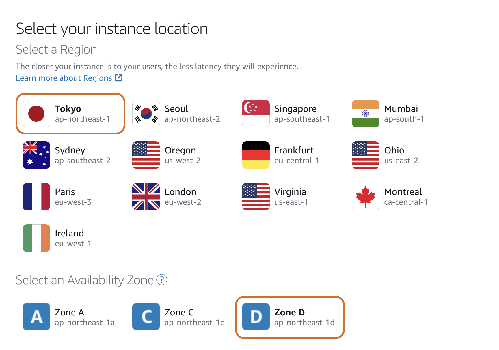

Today (May 2nd, 2020) I found out that AWS Lightsail Montreal region Zone D basically is useless. You cannot create any instance in zone D.

I encounter below error when I was doing unit testing. My code can create Lightsail instance in different availability zones in robin-round manner. I use AWS Lightsail API to discover the total supported availability zones then create instance in different zones. It is working fine for zone A and zone B, but then failed on zone D.

```json
 {
        message: 'Sorry, your requested bundle is not supported in your requested Availability Zone. Please retry your request with a different Availability Zone.',
        code: 'InvalidInputException',
        time: 2020-05-02T17:48:00.032Z,
        requestId: '93eb9203-e084-4b27-b22a-5b7c1a9d5b1c',
        statusCode: 400,
        retryable: false,
        retryDelay: 54.07827608478628
}
```

And I got the same error when tried to create an instance via web console. I tried to select different blueprint and different plan, including the most expensive plan (160USD/month), but got the same error. At this point, it is obviously that zone D is not useable.



And the naming of zone in Montreal region is a bit weird. As we know AWS uses letters to identify availability zones. One region can have up to six zones, from A to F. And Virgina is the only region that has six availability zones.



And if we look at the name of zone in Montral region, it is zone A, B and D. What happens to zone C?



This is the first time I realized the odd naming of zone D in Montreal zone. I double check the zone naming for all other regions. Tokyo is the only region that has this similar naming convention as Montreal. But Tokyo doesn't have this problem in zone D. I can create instance in zone D in Tokyo region.


I don't know it is just a temporary service outage or it is by design. If it is by design, it is not supported by Amazon, why it allows me to select this availability zone and not simply hides it? Something I cannot understand.

To work around this problem, I have to add more error handling logic to skip the unsupported zone.
