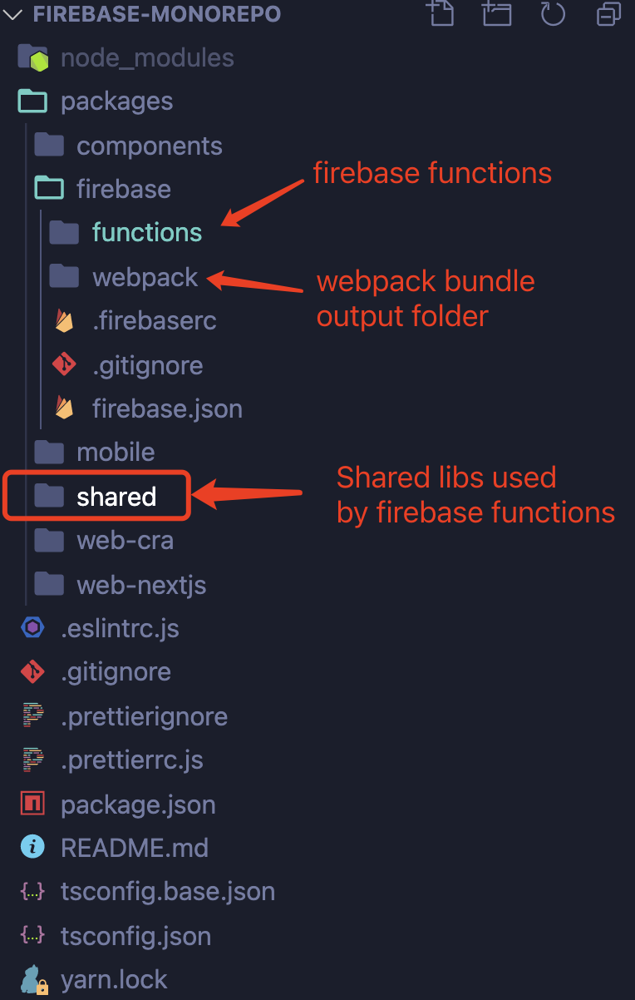
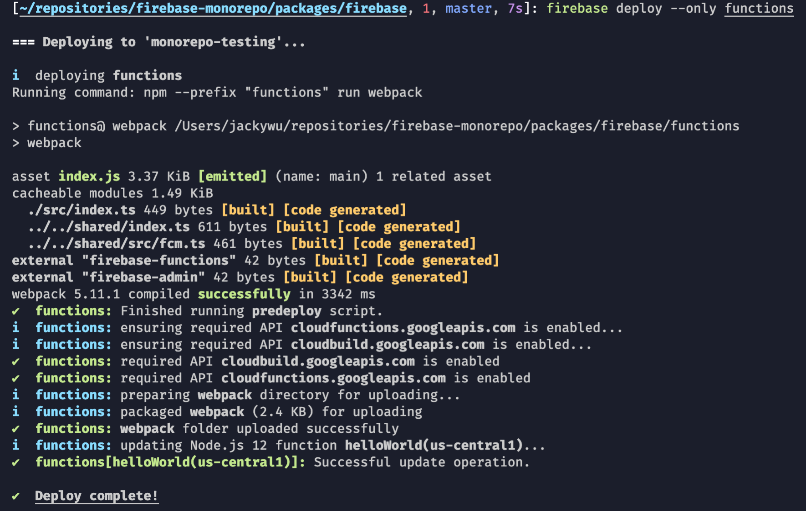

## Firebase Setup for Monorepo: Firebase + Yarn + Webpack

Firebase cli doesn't support monorepo, not yet when the time I am writing this blog. There is an open [issue](https://github.com/firebase/firebase-tools/issues/653) keep tracking it in its repo since 2018.

### The problem

Firebase expects all dependencies in Functions's packages.json are avaiable when it deploys your functions code in the Google Cloud. In a yarn monorepo, local shared packages are simply symbol links in node_modules which are not avaiable during cloud deployment. So Firebase will reports below error when you try to deploy functions:

```bash
error An unexpected error occurred: "https://registry.yarnpkg.com/<packagename>: Not found".
info If you think this is a bug, please open a bug report with the information provided in "/workspace/yarn-error.log".
```

To address this issue, there are two solutions:

1. Publish shared packages to NPM or Github so they are accessible during cloud deployment
2. Package your shared packages along with your functions code, there are two ways to package local dependencies in a monorepo:
   - Use yarn pack
   - Use webpack to bundle all local deps

Here I would like to share what I did to deploy Firebase functions in my monorep using yarn and webpack based on the tips/workarounds being discussed in above issue. I also created a demo repo [firebase-monorepo](https://github.com/jackywxd/firebase-monorepo) with all my configurations, you can simply clone it and follow alone. Below is the folder structure of the demo project.



- firebase - Your firbase folder
- shared - Shared libs used by firebase functions

Let's take a closer look of some key settings we need to set to make it works.

### Shared folder

Not much in the shared folder, this is where you implement all your shared libs or business logics. 

### package.json

Make sure shared package name starts with "@", so it can be used as local dependency by Firebase functions. The shared folder and webpack folder also should share the same dependencies.

```bash
{
  "name": "@jackywxd/shared",
  "version": "1.0.0",
  "description": "",
  "scripts": {
    "test": "echo \"Error: no test specified\" && exit 1"
  },
  "keywords": [],
  "author": "",
  "dependencies": {
    "firebase-admin": "^9.4.1",
    "firebase-functions": "^3.13.0"
  },
  "devDependencies": {
    "@typescript-eslint/eslint-plugin": "^4.9.1",
    "@typescript-eslint/parser": "^4.9.1",
    "eslint": "^7.15.0",
    "eslint-plugin-import": "^2.22.0",
    "firebase-functions-test": "^0.2.0",
    "typescript": "^4.1.2"
  },
  "private": true
}
```

### Settings for Firebase functions folder

In functions folder, two files need to be updated: package.json, firebase.json and webpack.config.js.

#### 1. firebase.json

In firebase.json file, we set the source to the webpack bundle output folder, in my case, it is set to "webpack". I also config the predeploy to call webpack prior deployment.

```bash
{
  "functions": {
    "source": "webpack",
    "predeploy": ["npm --prefix \"functions\" run webpack"]
  }
}
```

#### 2. package.json

In the package.json in functions folder, I add a new "webpack" entry to call webpack. Make sure devDependencies includes webpack, webpack-cli and webpack-node-externals which will be used in webpack.config.js. Your local package used by functions also should be added to dependencies.

```bash
{
  "name": "functions",
  "scripts": {
    "webpack": "webpack", 
    "lint": "eslint \"src/**/*\"",
    "build": "tsc",
    "serve": "npm run build && firebase emulators:start --only functions",
    "shell": "npm run build && firebase functions:shell",
    "start": "npm run shell",
    "deploy": "firebase deploy --only functions",
    "logs": "firebase functions:log"
  },
  "engines": {
    "node": "12"
  },
  "main": "lib/index.js",
  "dependencies": {
    "@jackywxd/shared": "*"
  },
  "devDependencies": {
    "@typescript-eslint/eslint-plugin": "^3.9.1",
    "@typescript-eslint/parser": "^3.8.0",
    "eslint": "^7.6.0",
    "eslint-plugin-import": "^2.22.0",
    "firebase-functions-test": "^0.2.0",
    "ts-loader": "^8.0.13",
    "typescript": "^3.8.0",
    "webpack": "^5.11.1",
    "webpack-cli": "^4.3.1",
    "webpack-node-externals": "^2.5.2"
  },
  "private": true
}
```

#### 3. webpack.config.js

Two key settings in the webpack.config.js file: externals and output. Make sure your local package used by functions is added to nodeExternals' allowlist.

In output section, set the filename to 'index.js' and path to the correct folder. This setting should match the setings in the package.json in webpack folder.

```bash
const path = require('path')
const nodeExternals = require('webpack-node-externals')

module.exports = {
  target: 'node',
  mode: 'production',
  entry: './src/index.ts',
  module: {
    rules: [
      {
        test: /\.tsx?$/,
        use: 'ts-loader',
        exclude: /node_modules/,
      },
    ],
  },
  optimization: {
    minimize: false,
  },
  performance: {
    hints: false,
  },
  devtool: 'nosources-source-map',
  resolve: {
    extensions: ['.tsx', '.ts', '.js', '.json'],
  },
  externals: [
    /^firebase.+$/,
    /^@google.+$/,
    nodeExternals({
      allowlist: [/^@jackywxd/],
    }),
  ],
  output: {
    filename: 'index.js',
    path: path.resolve(__dirname, '../webpack/dist'),
    libraryTarget: 'commonjs',
  },
}
```

### Webpack output folder

This is the webpack output folder configured in functions's webpack.config.js, only one package.json and one dist folder are required in this folder. Folder "dist" is the folder configured in the path of output section in the webpack.config.js file. Webpack bundled file will go to this folder with file name index.js.

The main in package.json in webpack folder should be set to "dist/index.js". It should have a deploy script to call firebase functions deploy. 

And as mentioned previously, all dependencies used by your local packages should be put in dependencies as well, so they will be installed correctly during cloud deployment.

```bash
{
  "name": "cloud-functions",
  "version": "1.0.0",
  "scripts": {
    "deploy": "firebase deploy --only functions"
  },
  "engines": {
    "node": "12"
  },
  "main": "dist/index.js",
  "dependencies": {
    "firebase-admin": "^9.4.1",
    "firebase-functions": "^3.13.0"
  },
  "devDependencies": {},
  "private": true
}
```

Finally, you may want to update .gitignore file to add the dist folder.

### The result

With the above setup, insde the firebase folder, I can simply use one command `firebase deploy --only functions` to bundle all of my code to webpack folder and deploy functions to Firebase.

And below is the deployment result.



This config works with yarn monorepo nicely and it is a common patter used by other projects such as serverless and serverless-webpack. Since I have been working with serverless for a while and quite famimiar with similar configuration, that's why I have chosen this solution.

Thanks for reading!