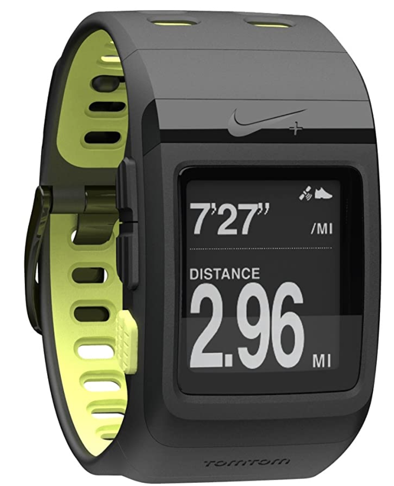
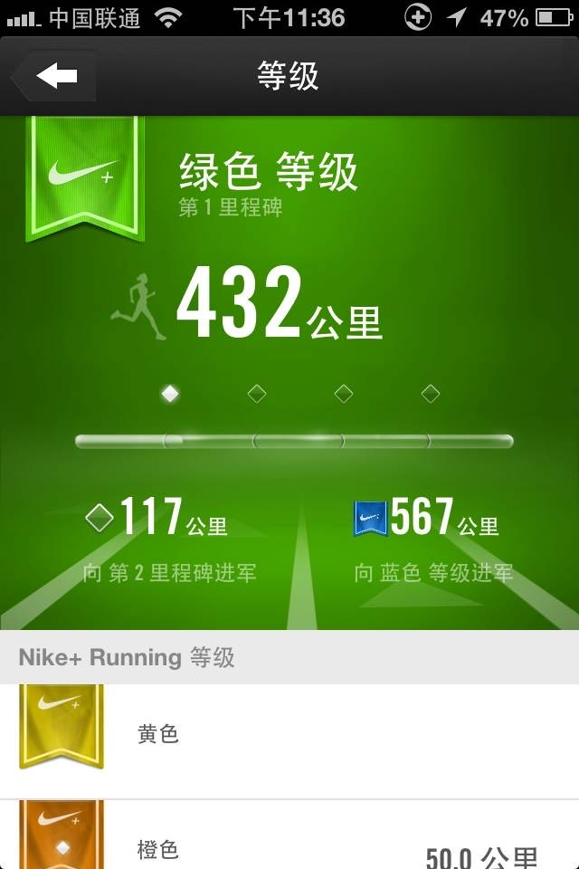
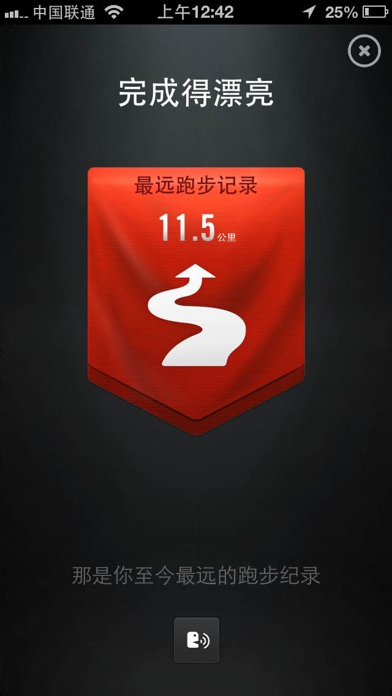
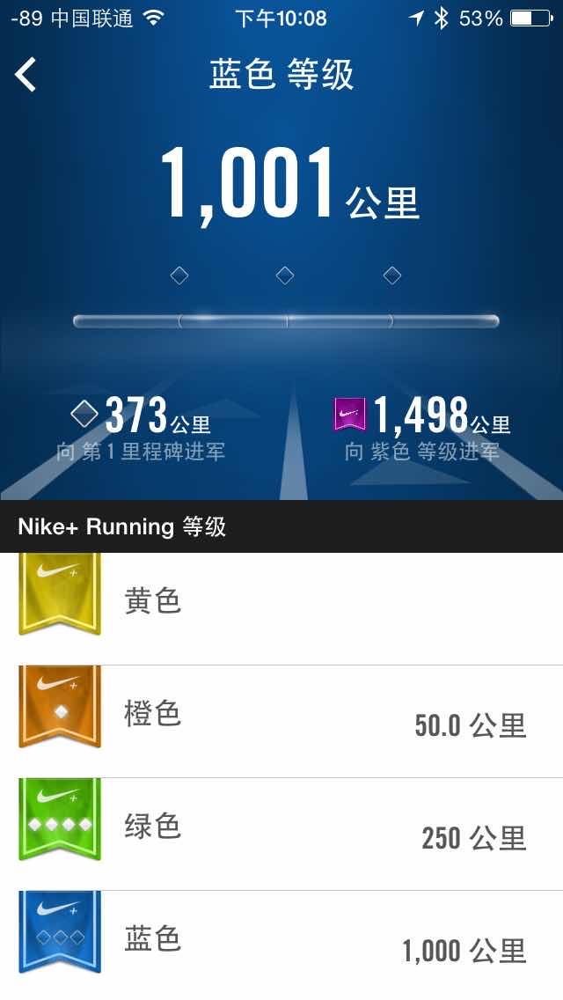
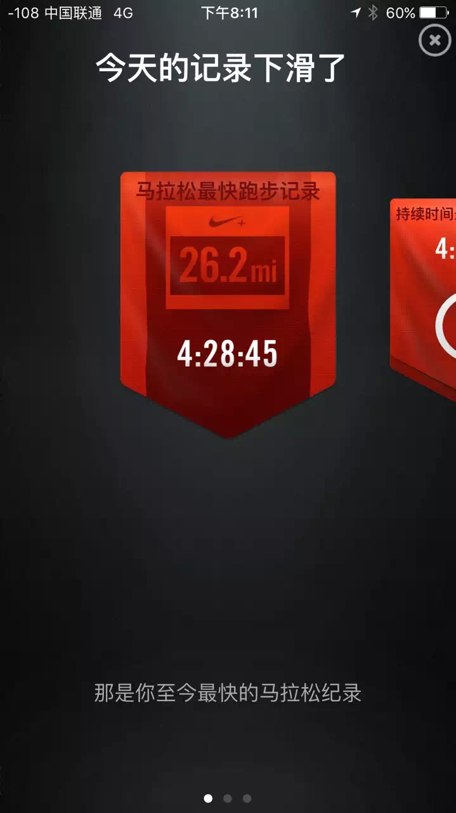
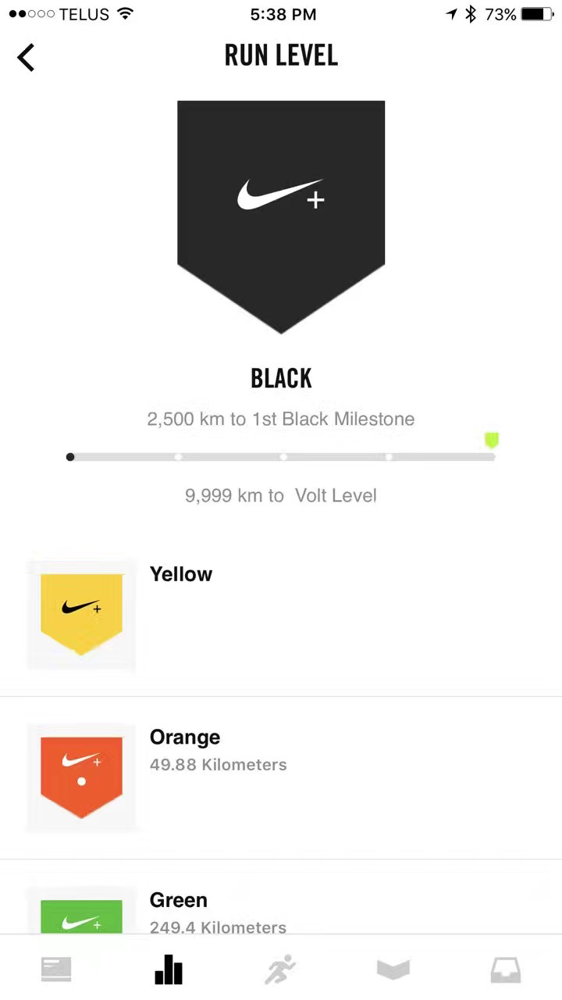
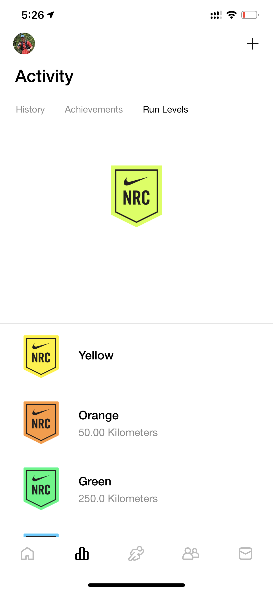
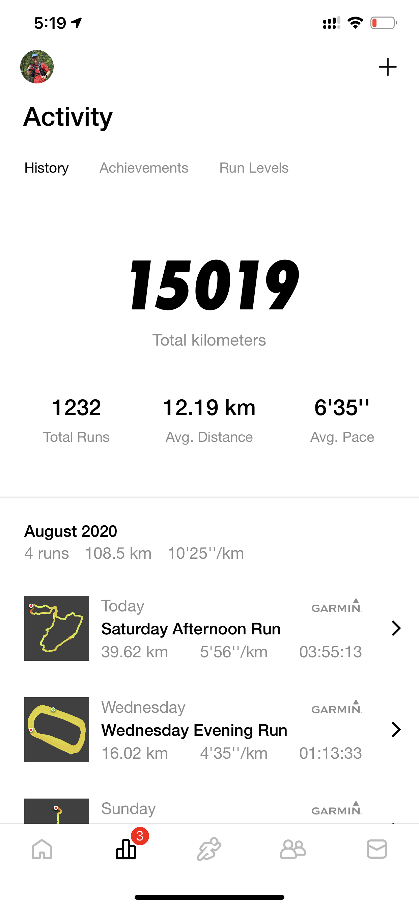
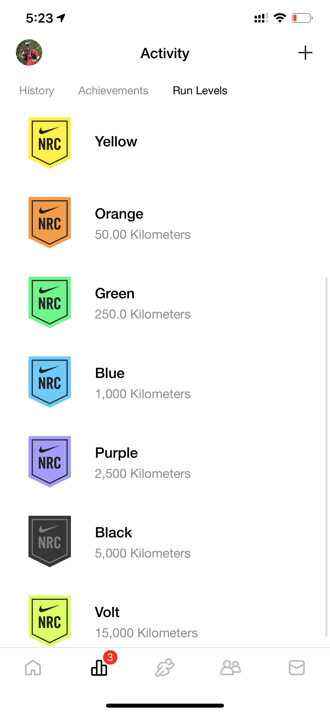

Today is a big day! My Nike Run finally reach the top Run Level, Volt! And that's it, no more next level.

Nike Run (was called Nike+ then) was my first App I used for tracking my run. I can't remember the exact time when I started using it, probably some time around 2012. At that time, GPS watch was still very rare. To keep track your run with Nike+, you need some sort of special Nike shoes that can hold a special little device in one of your shoes. It was designed for indoor running. I remember I had at least two pairs of those shoes. Later I bought a Nike+ GPS SportWatch when I more often ran outside. It also was the first GPS watch I owned, following a Apple Watch and finally stick with Garmin watch.

Eight years is a long time. But I am sure it is not the end of my journey but just start a new beginning!

### My first GPS watch

## Some major milestones with Nike+

### 2013-05-17: Green Level

### 2013-06-02: Longest run: 11.5K

### 2014-09-18: Blue Level

### 2015-09-12: Purple Level

### 2015-09-20: First full marathon

### 2017-02-25: Black Level

### 2020-08-08: Volt Level

